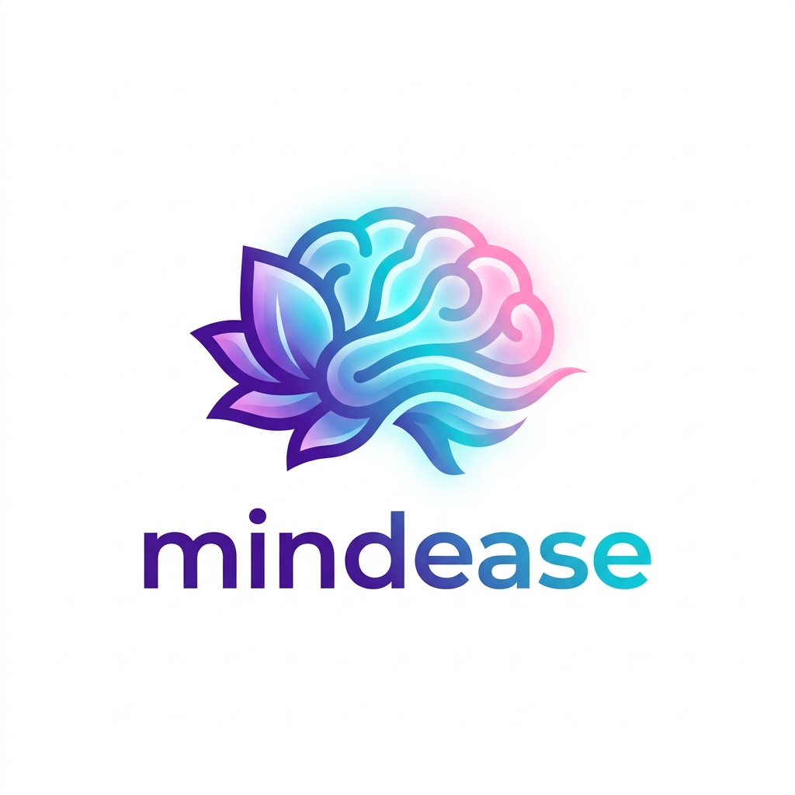

<!-- LOGO PROJECT -->

# 🧠 MindEase: Teman Pulih di Setiap Langkahmu 🌿
### *Healthy Lives & Well-being — Capstone Project Coding Camp 2026 powered by DBS Foundation*
ID Tim: **CC26-PSU186**

---

### 📌 Ringkasan Eksekutif
Banyak individu saat ini lebih merasa nyaman mencurahkan isi hati kepada AI dibandingkan orang terdekat karena minimnya penghakiman dan kemudahan akses 24/7. Namun, tren ini membawa risiko tinggi berupa *self-diagnosis* yang tidak akurat melalui pencarian mandiri di internet. 

**MindEase** hadir sebagai solusi *"painkiller"* untuk menjembatani celah antara kebutuhan validasi emosional dan penanganan medis yang kredibel. Proyek ini mengintegrasikan pelacakan suasana hati (*mood tracking*) harian dengan AI Chatbot berbasis NLP yang menganalisis sentimen dari riwayat percakapan pengguna untuk memprediksi potensi gangguan mental secara edukatif, sekaligus menyediakan akses langsung ke psikolog profesional melalui fitur telekonsultasi.

---

### 🧩 Fitur & Cakupan Proyek (Project Scope)
*   **Smart Assessment & Mood Check-in:** Antarmuka berbasis pilihan ganda untuk pelacakan emosi harian.
*   **History-Based AI Prediction:** Chatbot fungsional yang menganalisis tren sentimen percakapan untuk mendeteksi indikasi tingkat kelelahan mental (*burnout*) pengguna.
*   **Anonymous Community Forum (Safe Space):** Forum diskusi aman dengan sistem moderasi kata kunci otomatis (*word-filtering*) untuk mencegah *cyber-bullying* atau pemicu *self-harm*.
*   **Mindful Games:** Fitur tambahan berupa permainan ringan untuk membantu relaksasi pengguna.
*   **Admin Dashboard:** Panel fungsional yang dilengkapi visualisasi data interaktif serta manajemen basis pengguna (CRUD).

---

### 🛠️ Teknologi & Sumber Daya yang Digunakan
*   **Front-End:** ReactJS, Vite (Module Bundler), Tailwind CSS, Axios/Fetch (Networking Calls).
*   **Back-End & Database:** Node.js (Express.js) & PostgreSQL (RESTful API terotomatisasi).
*   **Machine Learning / AI:** Python, TensorFlow Functional API (Multi-Output Learning), Pre-trained Transformers.
*   **Deployment & Hosting:** Vercel, Render, Supabase.

---

### 👥 Anggota Tim Capstone (CC26-PSU186)

| Learning Path | ID Anggota | Nama Lengkap | Fokus Peran (Job Desk) | Status |
| :--- | :--- | :--- | :--- | :--- |
| **Full-Stack Web Dev** | CFCC220D6X0429 | **Fadhilah Nurhidayah** | Arsitektur Frontend UI/UX, React/Vite, Integrasi API & State Management. | Aktif |
| **Full-Stack Web Dev** | CFCC613D6Y1061 | **Natanael Nainggolan** | Arsitektur Server Express.js, Database PostgreSQL, RESTful API Design. | Aktif |
| **Data Scientist** | CDCC220D6X1237 | **Nia Nabilla** | Pengolahan Dataset Emosi, Analisis Tren Riwayat Suasana Hati & Validasi Statistik. | Aktif |
| **Data Scientist** | CDCC220D6X1240 | **Aulia Natasya Reyhana** | Pengolahan Dataset Emosi, Preprocessing Data & Analisis Validasi. | Aktif |
| **AI Engineer** | CACC220D6Y2323 | **Rezki Rahmat Alfi** | Pengembangan Model NLP (LSTM/Transformers) Sentimen Chat & Deploy Flask AI API. | Aktif |
| **AI Engineer** | CACC220D6Y2569 | **Ahmad Fadli Pratama** | Pembuatan Sistem Moderasi Konten Forum Otomatis (Blacklist/Filter Teks). | Aktif |

---

### 📅 Milestone & Jadwal Pengerjaan
*   **Minggu 1:** Research, Perancangan UI/UX, & Desain Database 📝
*   **Minggu 2:** Pengembangan API Backend & Preprocessing Data ⚙️
*   **Minggu 3:** Pengembangan Model NLP & Integrasi Frontend 🤖
*   **Minggu 4:** Integrasi AI ke Sistem Konsultasi, Handling Error & Testing 🧪
*   **Minggu 5:** Deployment, Finalisasi Dokumentasi, & Bug Fixing 🚀
